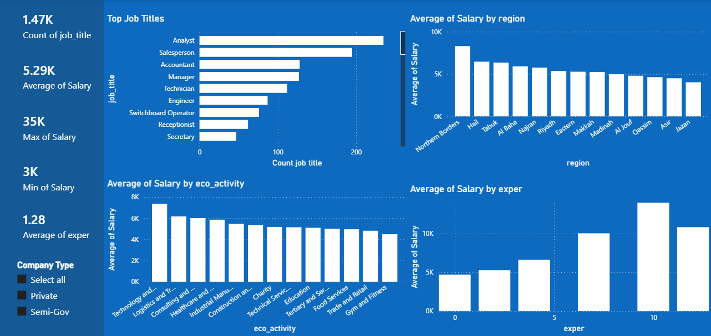
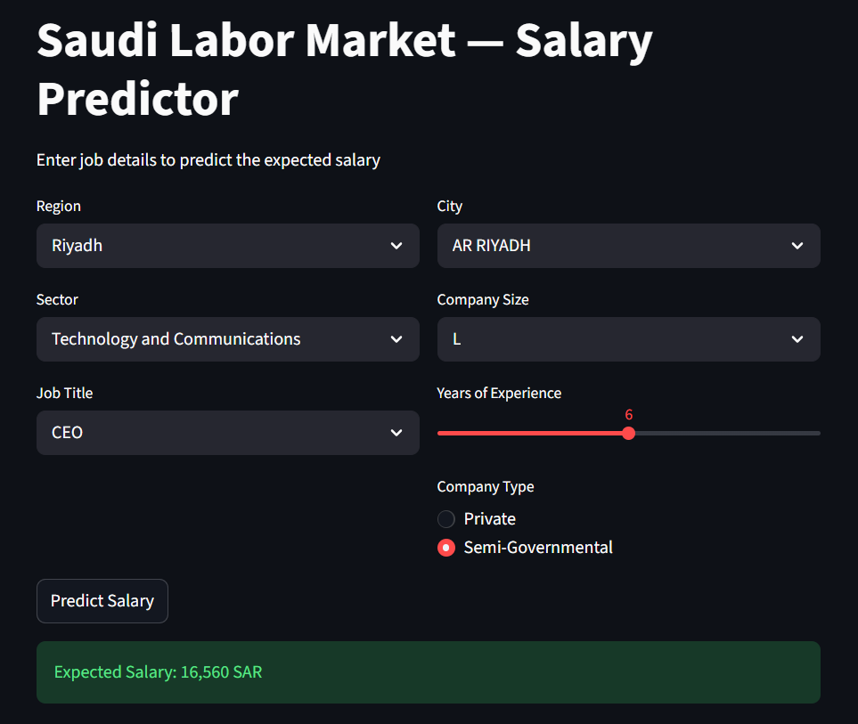

<div align="center">

# Saudi Job Market Analysis

### Exploratory Data Analysis, Salary Prediction & Interactive Web App on the Jadarat Dataset

[](https://www.python.org/)
[](https://jupyter.org/)
[](https://streamlit.io/)
[](https://powerbi.microsoft.com/)
[](https://pandas.pydata.org/)
[](https://scikit-learn.org/)
[](https://fastapi.tiangolo.com/)
[](https://www.kaggle.com/datasets/shaykhaaldawsari/jadarat-cleaned-data-csv?resource=download)
[]()
</div>

---

## Overview

An end-to-end data analytics project exploring the Saudi Arabian job market using listings sourced from the **Jadarat** (جدارات) platform. The project covers data cleaning, exploratory data analysis (EDA), salary prediction using machine learning, an interactive Power BI dashboard, a Streamlit web app, and a REST API built with FastAPI.

---

## Dashboard Preview



<div align="center">

| Total Listings | Avg. Salary | Max Salary | Min Salary | Avg. Experience |
|:---:|:---:|:---:|:---:|:---:|
| 1,470 | 5,290 SAR | 35,000 SAR | 3,000 SAR | 1.28 yrs |

</div>

---

## Salary Predictor App

An interactive web app built with **Streamlit** that predicts the expected monthly salary based on job inputs using a trained Random Forest model.



**Inputs accepted by the app:**

| Input | Type |
|---|---|
| Region | Dropdown |
| City | Dropdown (filtered by region) |
| Sector | Dropdown |
| Job Title | Dropdown |
| Company Size | Dropdown |
| Years of Experience | Slider (0–12) |
| Company Type | Radio (Private / Semi-Governmental) |

**Run the app locally:**
```bash
streamlit run app.py
```

---

## Project Structure

```
jadaratData/
├── data/
│   ├── processed_dataset.csv   # final dataset
│   └── saudi_jobs_cleaned.csv  # intermediate dataset
├── src/
│   ├── dashboard_preview.png   # dashboard screenshot
│   └── interface.png           # web app screenshot
├── analysis.ipynb              # EDA & ML notebook
├── app.py                      # Streamlit salary predictor
├── api.py                      # FastAPI REST endpoint
├── model.pkl                   # trained Random Forest pipeline
├── jadaratDashboard.pbix       # Power BI dashboard
└── README.md
```

---

## Dataset

> **Source:** [Jadarat Cleaned Data — Kaggle](https://www.kaggle.com/datasets/shaykhaaldawsari/jadarat-cleaned-data-csv?resource=download)

The processed dataset contains **1,470 rows** and **14 columns** with zero missing values after cleaning.

<details>
<summary><b>Column Reference</b></summary>
<br>

| Column | Type | Description |
|---|---|---|
| `job_title` | str | Standardized role (e.g., Analyst, Accountant) |
| `job_date` | str | Job posting date (Gregorian) |
| `comp_name` | str | Company name (original Arabic) |
| `comp_type` | int | `1` = Private, `0` = Semi-Governmental |
| `comp_size` | str | Size code (SB = Small B, MA = Medium A, …) |
| `eco_activity` | str | Industry sector (e.g., Trade and Retail, Healthcare) |
| `region` | str | Saudi region — translated & normalized |
| `city` | str | City name — translated & normalized |
| `contract` | int | `1` = Full-time, `0` = Remote |
| `benefits` | int | `1` = Benefits offered, `0` = None |
| `positions` | int | Number of open positions |
| `exper` | int | Years of experience required |
| `gender` | int | `0` = Male, `1` = Female, `2` = Both |
| `Salary` | float | Monthly salary in SAR |

</details>

---

## Key Findings

### Top Job Titles
| Rank | Job Title | Count |
|:---:|---|:---:|
| 1 | Analyst | 235 |
| 2 | Salesperson | 195 |
| 3 | Accountant | 128 |
| 4 | Manager | 127 |
| 5 | Technician | 112 |

### Average Salary by Region

**Northern Borders** leads with the highest average at **8,300 SAR**, while Jazan is the lowest at **4,020 SAR**.

| Region | Avg. Salary (SAR) |
|---|:---:|
| Northern Borders | 8,300 |
| Hail | 6,455 |
| Tabuk | 6,345 |
| Al Baha | 5,902 |
| Najran | 5,750 |
| Riyadh | 5,360 |

### Salary by Sector
Technology and Logistics sectors command the highest average salaries, while Food Services and Gym & Fitness are at the lower end.

### Salary vs. Experience
A clear positive correlation — professionals with 10+ years earn significantly more than entry-level candidates.

---

## Machine Learning Model

Trained and compared 3 regression models to predict employee salary in SAR.

### Model Comparison

| Model | MAE (SAR) | R² Score |
|---|:---:|:---:|
| **Random Forest** ✅ | **913** | **0.43** |
| Decision Tree | 1,066 | — |
| Linear Regression | 1,210 | — |
| Cross Validation (RF) | 1,134 | — |

> **Best Model: Random Forest** — lowest prediction error across all models, saved as `model.pkl` and deployed in the Streamlit app.

### Top Predictive Features

| Rank | Feature | Importance |
|:---:|---|:---:|
| 1 | Experience | 35% |

---

## Tools & Stack

| Tool | Purpose |
|---|---|
| Python · pandas · NumPy | Data cleaning & transformation |
| Matplotlib · Seaborn | Exploratory visualizations |
| scikit-learn | Machine learning models |
| Streamlit | Interactive salary predictor web app |
| FastAPI | REST API for salary prediction |
| Power BI | Interactive dashboard |

---

## How to Run

**Salary Predictor App**
```bash
pip install streamlit pandas scikit-learn
streamlit run app.py
```

**FastAPI — Salary Prediction Endpoint**
```bash
pip install fastapi uvicorn pandas scikit-learn
uvicorn api:app --reload
```

`POST /predict` — Request body:
```json
{
  "region": "Riyadh",
  "eco_activity": "Technology and Communications",
  "city": "AR RIYADH",
  "comp_size": "MA",
  "job_title": "Analyst",
  "exper": 10,
  "comp_type": 1
}
```

Response:
```json
{
  "predicted_salary": 16560.00
}
```

**Python Notebook**
```bash
pip install pandas numpy matplotlib seaborn scikit-learn jupyter
jupyter notebook analysis.ipynb
```

**Power BI Dashboard**

Open `jadaratDashboard.pbix` in [Power BI Desktop](https://powerbi.microsoft.com/desktop/).

---

## Data Source

Job listings collected from **Jadarat** (جدارات) — the Saudi national job portal operated under the Human Resources Development Fund (HRDF).

Dataset published on Kaggle: [shaykhaaldawsari/jadarat-cleaned-data-csv](https://www.kaggle.com/datasets/shaykhaaldawsari/jadarat-cleaned-data-csv?resource=download)
